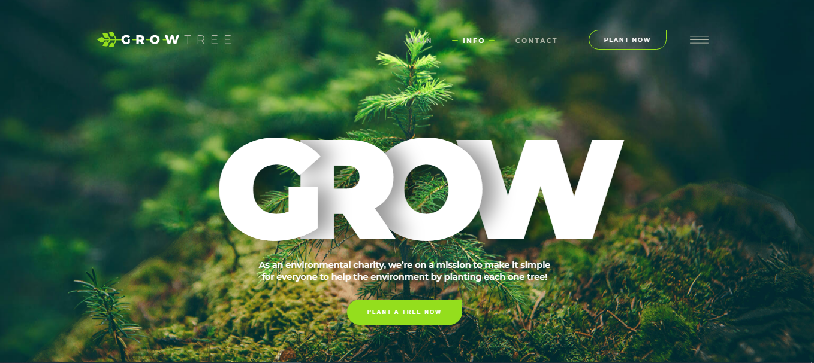

# Создание сайта с Parallax анимацией заголовка
# Creating a website with Parallax header animation

## реализован эффект глубины фонового изображения при скролле.
## implemented the effect of the depth of the background image when scrolling.

### десктопная версия, многие размеры подготовлены к адаптивному дизайну
### desktop version, many sizes are prepared for adaptive design

### HTML, CSS, JS

### С помощью SwiperJS реализован вертикальный слайдер.
### A vertical slider is implemented using Swipe JS.

